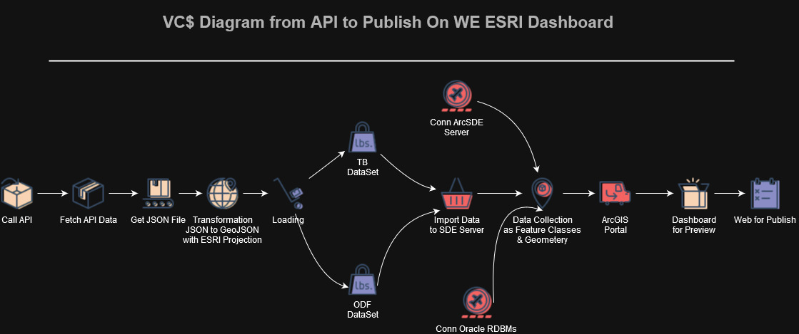

# VC4 integration to GIS Portal

> [!TIP]
> Sample script Optional information to help a user be more successful.

> [!CAUTION]
> Under Development.

### API JSON to Geodatabase visualized on ESRI Dashboard

#### Tools:
1. Python 3.10 (Windows 10)
2. Python Lib API (requests, urllib, urllib2)
3. Python Lib JSON (json, GeoJson, jprint)
4. Python Lib Geo (geopandas, shapely)
5. Python Lib ESRI (ArcPy, py2, ArcGIS 10.8, ArcSDE)

Screenshot for POC

> [!IMPORTANT]  
> You can contact me for complete script
